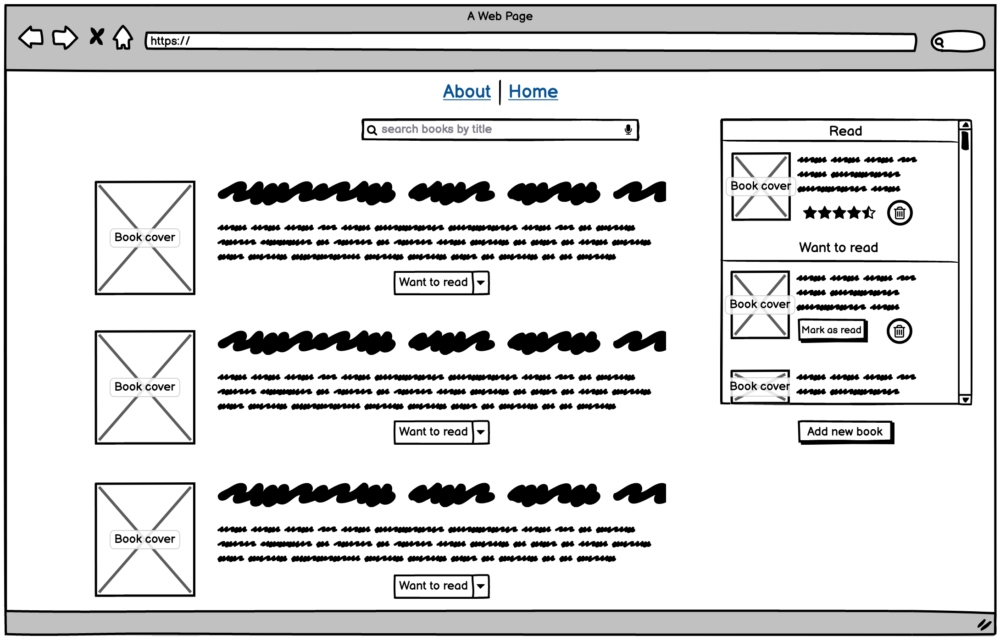

# Stage 1 - Technical Details :computer:
---
### Goals
The main idea behind **Thoth** is to incrementally build a *Goodreads*-like application based on software engineering books. We expect the final application to have a variety of features, including (but not limited to) authentication, messaging and social media and other 3rd party software integrations. The project will be developed in stages, where each stage will bring more challenging tasks. A snapshot of the project will be created at the end of each stage, in order to demonstrate its incremental development. 

### Stage 1 
The first stage of **Thoth** will be the starting point for development. A very basic website will be built and the first few tasks will be less challenging in terms of technical concepts, but will serve as a warm up for engineers - to get to know a bit more about git (concepts around **git branches**, **pull requests**, **code reviews**), and task tracking (**working with Trello**).

<!-- TODO link to Bec's baseling knowledge doc -->
- Tech stack - Following the [baseline knowledge requirements](../blob/master/LICENSE) the inital website will be created with *pure Javascript*, *HTML* and *custom CSS*. No special libraries or frameworks will be used at that stage of the project. 

- Prototype - as mentioned above, the goal of **Thoth** is to produce a website similar to *Goodreads*, below is an initial low fidelity prototype of what stage 1 of development might look like: 

- Functionality   

| User                                                    |  
| --------------------------------------------------------|
| Can see a list of books on the website                  | 
| Can add a book to the list                              |
| Can search books by name                                |
| Can rate books                                          |  
| Can see a list of read books                            | 
| Can add books to their list of read books               |     
| Can remove books from their list of read books          |  
| Can see a list of books they want to read               |       
| Can add books to their list of "want to read" books     |     
| Can remove books from their list of "want to read" books|  
