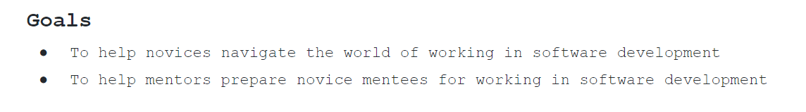
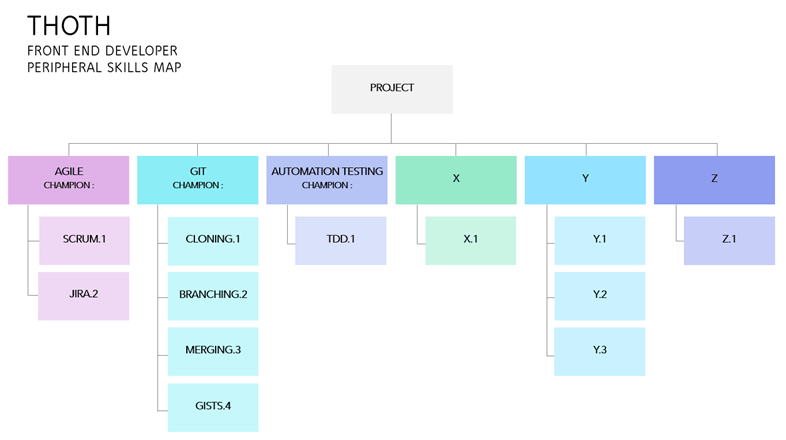

 

[from Stephen’s original slides =>GOALS Agreed!! 
Assumption: novices have reasonable coding skills in their chosen language(s) - or there are numerous mature, free resources in order to be able to attain coding skills – so focus need not be on the coding aspect.

However, the peripheral skills needed to transition into the workplace might not be known.  The requisite skills need to be 

* Identified
* Prioritised
* Practiced 

And this is the problem that Thoth aims to solve!
Provide novices with a narrow shortlist of peripheral skills, prioritised, along with a framework of resources/support to gain practical experience. The aim to help them to get to the workplace faster and with confidence 

[Objectives]
1. Thoth aims to provide a mentee looking for a specific job role (e.g. Front-End web-developer] with a validated roadmap of prioritised skills split by  sub-domain 

2. Thoth, in each sub-domain will identify 2 or 3 essential skills and direct them to a recommended learning resource/s.
3. Mentee to be assigned tasks on Thoth project that touch on these learning objectives to gain practical experience.
4. Thoth to provide links/introductions to Mentors/Champions in each domain that volunteer to give guidance as and when necessary. A support framework. Feedback from Mentor to Mentee
5. Thoth could provide a forum for mentee to present project work and obtain feedback advice in a supportive environment.

One way we might implement this…

1. Perhaps identify a couple of job -roles - e.g. Web Developer, Back-End Developer (Entry Level)
2. In the group, determine the short list of skills that would be highly desirable when you land the role to produce a couple of maps (as above)
3. Ask for ideas, resources where mentees' can learn, practice these essential skills and how they might be able to evidence competence –
4. Ask for volunteer champions to support sub-domains

